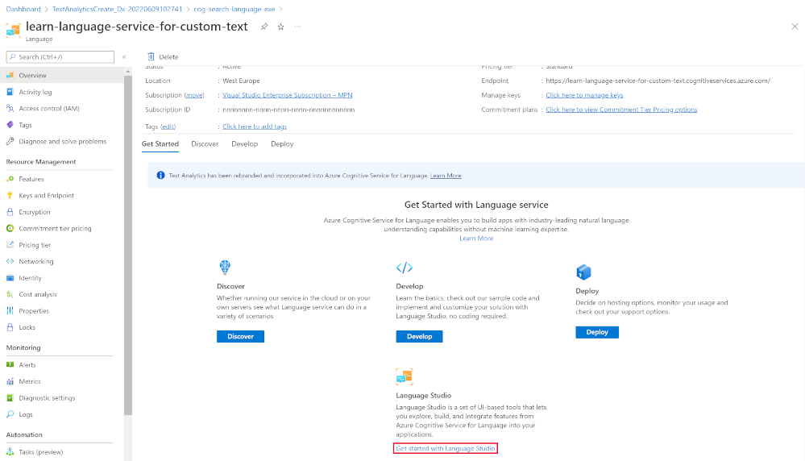
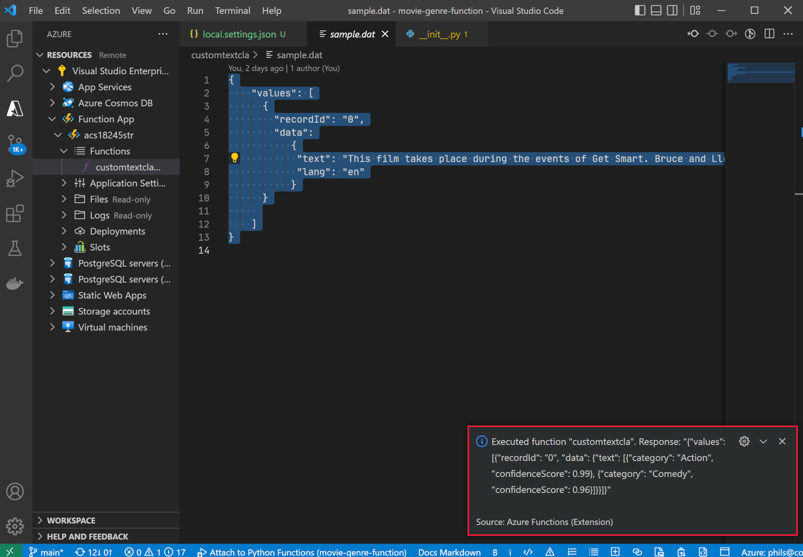

---
lab:
  title: 使用自定义类扩充 AI 搜索索引
---

# 使用自定义类扩充 AI 搜索索引

你构建了一个搜索解决方案，现在想要在索引中添加用于语言扩充的 Azure AI 服务。

在本练习中，你将创建一个 Azure AI 搜索解决方案，并使用来自 Language Studio 自定义文本分类项目的结果扩充索引。 你将创建一个函数应用，将搜索和分类模型连接在一起。

> 注意：完成本练习需要 Microsoft Azure 订阅。**** 如果你还没有该订阅，可通过 [https://azure.com/free](https://azure.com/free?azure-portal=true) 注册免费试用版。

## 使用 Python、VS Code 和 VS Code 扩展设置开发环境

安装这些工具来完成本练习。 即便没有这些工具，你也能执行这些步骤。

1. 安装 [VS Code](https://code.visualstudio.com/)
1. 安装 [Azure Functions Core Tools](https://github.com/Azure/azure-functions-core-tools)
1. 安装 VSCode 的 Azure Tools 扩展[](https://code.visualstudio.com/docs/azure/extensions)
1. 为操作系统安装 [Python 3.8](https://www.python.org/downloads/release/python-380/)。
1. 安装 VSCode 的 Python 扩展[](https://marketplace.visualstudio.com/items?itemName=ms-python.python)

## 设置 Azure 资源

为了节省时间，请选择此 Azure ARM 模板来创建后面练习中需要的资源。

### 部署预生成的 ARM 模板

1. [](https://portal.azure.com/#create/Microsoft.Template/uri/https%3A%2F%2Fraw.githubusercontent.com%2FMicrosoftLearning%2Fmslearn-doc-intelligence%2Fmain%2Fcognitive-search%2Fazuredeploy.json)。 选择此链接以创建起始资源。 可能需要将直接链接复制并粘贴到搜索栏中。[](https://portal.azure.com/#create/Microsoft.Template/uri/https%3A%2F%2Fraw.githubusercontent.com%2FMicrosoftLearning%2Fmslearn-doc-intelligence%2Fmain%2Fcognitive-search%2Fazuredeploy.json)

    
1. 在“资源组”中，选择“新建”并将其命名为 cog-search-language-exe。
1. 在“区域”中，选择离你较近的[受支持区域](https://learn.microsoft.com/azure/ai-services/language-service/concepts/regional-support)。
1. 资源前缀需要全局唯一，请输入随机数字和小写字母前缀，例如 acs18245********。
1. 在“位置”中，选择和上面选择的相同区域。
1. 选择“查看 + 创建”。
1. 选择“创建”。

    > 注意：出现一个错误：“你需要同意以下服务条款才能成功创建此资源。”选择“创建”即表示同意这些条款************。

1. 选择“转到资源组”以查看已创建的所有资源。

    
你将设置 Azure 认知搜索索引、创建 Azure 函数并创建 Language Studio 项目，以从摘要中识别电影流派。

### 上传示例数据以训练语言服务

本练习使用 210 个文本文件，其中包含一部电影的情节摘要。 文本文件的名称是电影标题。 该文件夹还包含一个 movieLabels.json 文件，该文件将电影的流派映射到文件中，每个文件都有如下所示的 JSON 条目****：

```json
{
    "location": "And_Justice_for_All.txt",
    "language": "en-us",
    "classifiers": [
        {
            "classifierName": "Mystery"
        },
        {
            "classifierName": "Drama"
        },
        {
            "classifierName": "Thriller"
        },
        {
            "classifierName": "Comedy"
        }
    ]
},
```

1. 从 GitHub 下载[示例数据](https://github.com/Azure-Samples/cognitive-services-sample-data-files/blob/master/language-service/Custom%20text%20classification/Custom%20multi%20classification%20-%20movies%20summary.zip)，将其保存在本地计算机。

    
1. 打开“Custom multi classification - movies summary.zip”文件，并提取包含所有文件的文件夹****。

    > 注意：可以使用这些文件在 Language Studio 中训练模型，还可以为 Azure 认知搜索中的所有文件编制索引。****

1. 在 Azure 门户中选择“资源组”，然后选择你的资源组****。[](https://portal.azure.com/)
1. 选择你创建的存储帐户，例如“acs18245str”。****
1. 从左侧窗格中选择“配置”，针对“允许 Blob 匿名访问”设置选择“启用”选项，然后选择页面顶部的“保存”**************。

    

1. 从左侧选择“容器”，然后选择“+ 容器”********。
1. 在“新建容器”窗格的“名称”中，输入“language-studio-training-data”************。
1. 在“匿名访问级别”中，选择“容器(对容器和 Blob 进行匿名读取访问)”，然后选择“创建”************。
1. 选择刚刚创建的新容器 language-studio-training-data****。
    
1. 选择窗格顶部的“上传”****。
1. 在“上传 Blob”窗格中，选择“浏览文件”********。
1. 导航到下载示例文件的位置，选择所有文本 (`.txt`) 和 json (`.json`) 文件。
1. 在窗格中选择“上传”****。
1. 关闭“上传 Blob”窗格****。

### 创建语言资源

1. 在页面顶部的痕迹导航链接中，选择“主页”****。
1. 选择“+ 创建资源”**** 并搜索“语言服务”**。
1. 在“语言服务”下选择“创建”。********
1. 选择包含“自定义文本分类”和“自定义命名实体识别”的选项****。

    
1. 选择“继续创建资源”****。

    
1. 在“资源组”中，选择“cog-search-language-exe”********。
1. 在“区域”中，选择上面使用的区域****。
1. 在“名称”中，输入“learn-language-service-for-custom-text”********。 它必须全局唯一，因此可能需要在末尾添加一个任意数字或字符。
1. 对于“定价层”，选择“S”********。
1. 在“新建/现有存储帐户”中，选择“现有存储帐户”********。
1. 在“当前所选订阅和资源区域中的存储帐户”中，选择创建的存储帐户，例如 acs18245str********。
1. 同意“负责任的 AI 通知”条款，然后选择“查看 + 创建”********。
1. 选择**创建**。
1. 等待部署资源，然后选择“转到资源组”****。
1. 选择“learn-language-service-for-custom-text”****。

    
1. 向下滚动到“概述”窗格，并选择“Language Studio入门”********。
1. 登录 Language Studio。 如果系统提示选择语言资源，请选择之前创建的资源。

### 在 Language Studio 中创建新的自定义文本分类项目

1. 在 Language Studio 主页上，选择“新建”，然后选择“自定义文本分类”********。

    

1. 选择**下一步**。

    
1. 选择“多标签分类”，然后选择“下一步”********。

    

1. 在“名称”中，输入“movie-genre-classifier”********。
1. 在“文本主要语言”中，选择“英语(美国)”********。
1. 在“说明”中，输入“可以从摘要中识别电影流派的模型”********。
1. 选择“是，启用多语言数据集”****。
1. 选择**下一步**。

    

1. 在“Blob 存储容器”中，选择“language-studio-training-data”********。
1. 选择“是的，我的文档已标记，并且我有一个格式正确的 JSON 标签文件”****。
1. 在“标签文档”中，选择“movieLabels”********。
1. 选择**下一步**。
1. 选择“创建项目”。

### 训练自定义文本分类 AI 模型

1. 在左侧，选择“训练作业”****。

    

1. 单击“+ 启动训练作业”****。

    
1. 在“训练新模型”中，输入“movie-genre-classifier”********。
1. 选择“训练”。
1. 训练分类器模型的时间应少于 10 分钟。 等待状态更改为“训练成功”****。

### 部署自定义文本分类 AI 模型

1. 在左侧，选择“部署模型”****。

    
1. 选择“添加部署”****。

    
1. 在“创建新部署名称”中，输入“test-release”********。
1. 在“模型”中，选择“movie-genre-classifier”********。
1. 选择“部署”。

使此网页保持打开状态，供稍后在本练习中使用。

### 创建 Azure AI 搜索索引

创建可以使用此模型扩充的搜索索引，你将为所有包含已下载电影摘要的所有文本文件编制索引。

1. 在 Azure 门户中，选择“资源组”，选择你的资源组，然后选择创建的存储帐户，例如 acs18245str。[](https://portal.azure.com/)********
1. 从左侧选择“容器”，然后选择“+ 容器”********。
1. 在“新建容器”窗格的“名称”中，输入 search-data************。
1. 在“匿名访问级别”中，选择“容器”。********
1. 选择**创建**。
1. 选择刚刚创建的容器 search-data****。
1. 选择窗格顶部的“上传”****。
1. 在“上传 Blob”窗格中，选择“浏览文件”********。
1. 导航到下载示例文件的位置，仅选择文本 (`.txt`) 文件****。
1. 在窗格中选择“上传”****。
1. 关闭“上传 Blob”窗格****。

### 将文档导入 Azure AI 搜索

1. 在左侧选择“资源组”，然后选择你的资源组，接着选择搜索服务。****

1. 选择“导入数据”。

    
1. 在“数据源”中，选择“Azure Blob 存储”********。
1. 在“数据源名称”中，输入“movie-summaries”********。
1. 选择“选择现有连接”，然后选择存储帐户，接着选择刚刚创建的容器，搜索数据。********
1. 选择“添加认知技能(可选)”。****
1. 展开“附加 AI 服务”部分，然后选择先前创建的的 Azure AI 服务。****

    
1. 展开“添加扩充”部分。

    
1. 保留所有字段的默认值，然后选择“提取人员姓名”****。
1. 选择“提取关键短语”****。
1. 选择“检测语言”****。
1. 单击“下一步：自定义目标索引”。

    
1. 保留所有字段的默认值，对于 metadata_storage_name，选择“可检索”和“可搜索”************。
1. 选择“下一步:创建索引器”。
1. 选择“提交”。

索引器将运行并创建 210 个文本文件的索引。 无需等待该过程，你可继续执行后续步骤。

## 创建函数应用以扩充搜索索引

现在，你将创建认知搜索自定义技能集将调用的 Python 函数应用。 该函数应用将使用自定义文本分类器模型来扩充搜索索引。

1. 打开 VScode，并在终端中将此 GitHub 存储库克隆到计算机。

    ```bash
    git clone https://github.com/MicrosoftLearning/mslearn-doc-intelligence movie-genre-function
    ```

1. 在 Visual Studio Code 中，打开刚刚克隆的“movie-genre-function”文件夹****。

    
1. 如果已安装所有必需的扩展，系统会提示你优化项目。 选择**是**。
    
1. 选择 Python 解释器，应为版本 3.8。
1. 工作区将更新，如果系统要求你将其连接到工作区文件夹，请选择“是”****。
1. 按 F5 调试应用****。

    
    如果应用正在运行，应会看到可用于本地测试的 localhost URL。

1. 停止调试应用，按 SHIFT + F5********。

### 将本地函数应用部署到 Azure

1. 在 Visual Studio Code 中，按 F1 打开命令面板****。
1. 在命令面板中，搜索并选择 `Azure Functions: Create Function App in Azure...`。
1. 为函数应用输入全局唯一名称，例如 acs13245str-function-app****。
1. 在“选择运行时堆栈”中，选择“Python 3.8”********。
1. 选择上面使用的相同位置。

1. 在左侧导航栏中，选择“Azure 扩展”****。
    
1. 展开“资源”，在订阅下展开“函数应用”，然后右键单击函数，例如 acs13245-function-app************。
1. 选择“部署到函数应用”****。 等待应用部署完成。
1. 展开应用，右键单击“应用程序设置”，选择“下载远程设置”********。
1. 在左侧选择“资源管理器”，然后选择 local.settings.json********。

    
该函数应用需要连接到自定义文本分类模型。 按照以下步骤获取配置设置。

1. 在浏览器中，导航到“Language Studio”，你应该位于“部署模型”页********。

    
1. 选择模型。 然后选择“获取预测 URL”****。
1. 选择“预测 URL”旁边的复制图标****。
1. 在 Visual Studio Code 中的 local.settings.json 底部，粘贴预测 URL****。
1. 在“Language Studio”的左侧，选择“项目设置”********。

    
1. 单击“主键”旁边的复制图标****。
1. 在 Visual Studio Code 中的 local.settings.json 的底部，粘贴主键****。
1. 编辑设置以在底部添加这四行，将终结点复制到 `TA_ENDPOINT` 值中。

    ```json
    ,
    "TA_ENDPOINT": " [your endpoint] ",
    "TA_KEY": " [your key] ",
    "DEPLOYMENT": "test-release",
    "PROJECT_NAME": "movie-genre-classifier"
    ```

1. 将主键复制到 `TA_KEY` 值中。

    ```json
    {
      "IsEncrypted": false,
      "Values": {
        "AzureWebJobsStorage": "DefaultEndpointsProtocol=https;AccountName=...",
        "FUNCTIONS_EXTENSION_VERSION": "~4",
        "FUNCTIONS_WORKER_RUNTIME": "python",
        "WEBSITE_CONTENTAZUREFILECONNECTIONSTRING": "DefaultEndpointsProtocol=https;AccountName=...",
        "WEBSITE_CONTENTSHARE": "acs...",
        "APPINSIGHTS_INSTRUMENTATIONKEY": "6846...",
        "TA_ENDPOINT": "https://learn-languages-service-for-custom-text.cognitiveservices.azure.com/language/analyze-text/jobs?api-version=2022-05-01",
        "TA_KEY": "7105e938ce1...",
        "DEPLOYMENT": "test-release",
        "PROJECT_NAME": "movie-genre-classifier"
      }
    }

    ```

    设置应如上所示，附带项目的值。
 
1. 按 Ctrl+S 保存 local.settings.json 的更改************。
1. 在左侧导航栏中，选择“Azure 扩展”****。
1. 展开“资源”，在订阅下展开“函数应用”，然后右键单击“应用程序设置”，选择“上传本地设置”****************。

### 测试远程函数应用

这里有一个示例查询，可用于测试函数应用和分类器模型是否正常工作。

1. 在左侧选择“资源管理器”，展开 customtextcla 文件夹，然后选择“sample.dat”************。

    
1. 复制该文件的内容。
1. 在左侧，选择“Azure 扩展”****。

    
1. 在“函数应用”下，展开“Functions”，右键单击“customtextcla”，然后选择“立即执行函数”****************。
1. 在“输入请求正文”中，粘贴复制的示例数据，然后按“Enter”********。

    函数应用将以 JSON 结果做出响应。

1. 展开通知以查看整个结果。

    
    JSON 响应应如下所示：

    ```json
    {"values": 
        [
            {"recordId": "0", 
            "data": {"text": 
            [
                {"category": "Action", "confidenceScore": 0.99}, 
                {"category": "Comedy", "confidenceScore": 0.96}
            ]}}
        ]
    }
    ```

### 将字段添加到搜索索引

你需要一个位置来存储新函数应用返回的扩充。 按照以下步骤添加新复合字段，以存储文本分类和置信度分数。

1. 在 Azure 门户中，转到包含你的搜索服务的资源组，然后选择你创建的认知搜索服务，例如 acs18245-search-service。[](https://portal.azure.com/)****
1. 在“概述”窗格上，选择“索引”********。
1. 选择 azurebob-index****。
1. 选择“编辑 JSON”。****
1. 向索引添加新字段，将 JSON 粘贴到内容字段下方。

    ```json
    {
      "name": "textclass",
      "type": "Collection(Edm.ComplexType)",
      "analyzer": null,
      "synonymMaps": [],
      "fields": [
        {
          "name": "category",
          "type": "Edm.String",
          "facetable": true,
          "filterable": true,
          "key": false,
          "retrievable": true,
          "searchable": true,
          "sortable": false,
          "analyzer": "standard.lucene",
          "indexAnalyzer": null,
          "searchAnalyzer": null,
          "synonymMaps": [],
          "fields": []
        },
        {
          "name": "confidenceScore",
          "type": "Edm.Double",
          "facetable": true,
          "filterable": true,
          "retrievable": true,
          "sortable": false,
          "analyzer": null,
          "indexAnalyzer": null,
          "searchAnalyzer": null,
          "synonymMaps": [],
          "fields": []
        }
      ]
    },
    ```

    索引现应如下所示。

    
1. 选择“保存”。

### 编辑自定义技能集以调用函数应用

认知搜索索引需要一种方法来填充这些新字段。 编辑之前创建的技能集来调用函数应用。

1. 在页面顶部，选择搜索服务链接，例如 acs18245-search-service| Indexes****。

1. 在“概述”窗格上，选择“技能集”********。

    
1. 选择“azureblob-skillset”****。
1. 通过将其粘贴为第一个技能集，添加下面的自定义技能集定义。

    ```json
    {
      "@odata.type": "#Microsoft.Skills.Custom.WebApiSkill",
      "name": "Genre Classification",
      "description": "Identify the genre of your movie from its summary",
      "context": "/document",
      "uri": "URI",
      "httpMethod": "POST",
      "timeout": "PT30S",
      "batchSize": 1,
      "degreeOfParallelism": 1,
      "inputs": [
        {
          "name": "lang",
          "source": "/document/language"
        },
        {
          "name": "text",
          "source": "/document/content"
        }
      ],
      "outputs": [
        {
          "name": "text",
          "targetName": "class"
        }
      ],
      "httpHeaders": {}
    },
    ```

需要将 `"uri": "URI"` 更改为指向函数应用。

1. 在 Visual Studio Code 中，选择“Azure 扩展”****。

    
1. 在“Functions”下，右键单击“customtextcla”，然后选择“复制函数 Url”************。
1. 在 Azure 门户上，将 URI 替换为复制的函数 URL。 
1. 选择“保存”。

### 在索引器中编辑字段映射

你现在拥有了存储扩充的字段和调用函数应用的技能集，最后一步是告知认知搜索将扩充放置在何处。

1. 在页面顶部，选择搜索服务，例如 acs18245-search-service| Skillsets 链接****。

    
1. 在“概述”窗格上，选择“索引器”********。
1. 选择“azureblob-indexer”****。
1. 选择“索引器定义(JSON)”。
1. 通过将此字段定义粘贴到输出字段部分的顶部，添加新的输出字段映射。

    ```json
    {
      "sourceFieldName": "/document/class",
      "targetFieldName": "textclass"
    },
    ```

    索引器 JSON 定义现在应如下所示：

    
1. 选择“保存”。
1. 选择“重置”，然后选择“是”********。
1. 选择“运行”，然后选择“是”********。

    Azure 认知搜索服务运行更新后的索引器。 索引器使用编辑过的自定义技能集。 技能组使用正在编制索引的文档调用函数应用。 自定义文本分类器模型使用文档中的文本来尝试识别电影的流派。 该模型返回一个带有流派和置信度级别的 JSON 文档。 索引器使用新的输出字段映射将 JSON 结果映射到索引中的字段。

1. 选择“执行历史记录”****。
1. 检查索引器是否已针对 210 个文档成功运行。

    
    可能需要选择“刷新”来更新索引器的状态****。

## 测试扩充的搜索索引

1. 在页面顶部，选择搜索服务，例如 acs18245-search-service| Indexers****。

1. 在“概述”窗格上，选择“索引”********。
1. 选择 azurebob-index****。

    
1. 选择**搜索**。
1. 浏览搜索结果。

索引中的每个文档都应有一个可搜索的新的 `textclass` 字段。 它包含附带电影流派的类别字段。 可以指定多个。 它还显示了自定义文本分类模型对已识别的流派的信心。

现已完成练习，请删除所有不再需要的资源。

### 删除练习资源

1. 在 Azure 门户中，转到主页，然后选择“资源组”。****
1. 选择不需要的资源组，然后选择“删除资源组”。****
