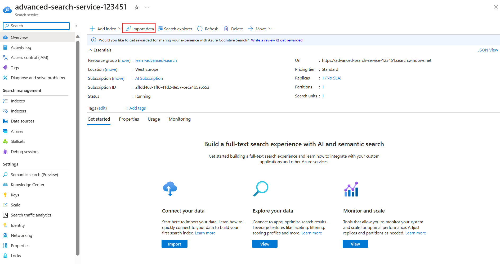
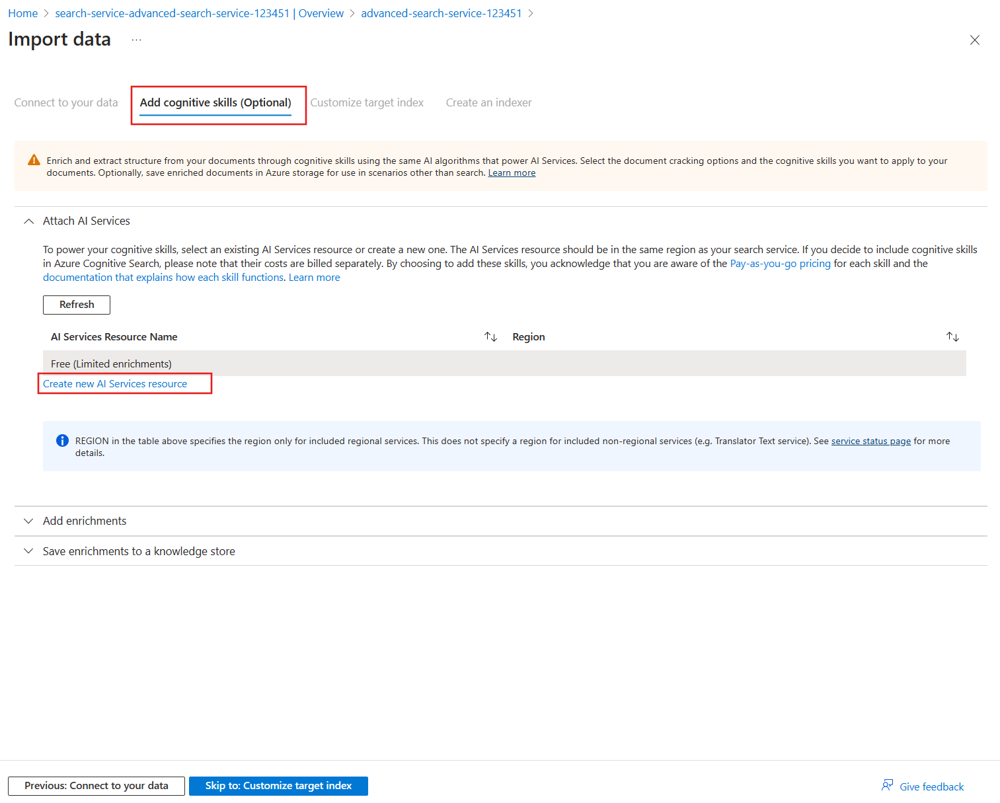

---
lab:
  title: 实现搜索结果增强
---

# 实现搜索结果增强

你有一个假日预订应用使用的现有搜索服务。 你已经看出，搜索结果的相关性会影响你获得的预订数量。 你最近还在葡萄牙新开了酒店，所以希望提供葡萄牙语作为支持语言。

在本练习中，你将添加计分概要文件以提高搜索结果的相关性。 然后，你将使用 Azure AI 服务为所有酒店添加葡萄牙语说明。

> **注意** 为了完成本练习，你需要 Microsoft Azure 订阅。 如果你还没有，可在 [https://azure.com/free](https://azure.com/free?azure-portal=true) 注册免费试用版。

## 创建 Azure 资源

你将创建 Azure AI 搜索服务并导入示例酒店数据。

1. 登录 [Azure 门户](https://portal.azure.com/learn.docs.microsoft.com?azure-portal=true)。
1. 选择 **+ 创建资源**。
1. 搜索“搜索”，然后选择“Azure AI 搜索”。********
1. 选择**创建**。
1. 在资源组下选择“新建”，将其命名为 learn-advanced-search。********
1. 在“服务名称”中，输入“advanced-search-service-12345”。 名称必须是全局唯一的，因此请在名称末尾添加随机数。
1. 选择你附近的受支持区域。
1. 使用定价层的默认值。
1. 选择“查看 + 创建”。
1. 选择“创建”。
1. 等待部署资源，然后选择“转到资源”。

### 将示例数据导入搜索服务

导入示例数据。

1. 在“概述”窗格上，选择“导入数据”。

    
1. 在“导入数据”窗格的“数据源”下拉列表上，选择“示例”。************
1. 选择“hotels-sample”。

1. 在“添加认知技能(可选)”选项卡上，展开“附加 AI 服务”，然后选择“创建新的 AI 服务资源”。************

    

### 创建 Azure AI 服务以支持翻译

1. 在新选项卡中，登录到 Azure 门户。
1. 在“资源组”中，选择“learn-advanced-search”。
1. 在“区域”中，选择为搜索服务选择的相同区域。
1. 在“名称”中，输入 learn-cognitive-translator-12345 或你偏好的任何名称。******** 名称必须是全局唯一的，因此请在名称末尾添加随机数。
1. 在定价层中，选择“标准 S0”。
1. 选中“选中此框即表示我确认我已阅读并理解以下所有条款”。
1. 选择“查看 + 创建”。
1. 选择“创建”。
1. 创建完资源后，关闭选项卡。

### 添加翻译扩充

1. 在“添加认知技能(可选)”选项卡上，选择“刷新”。
1. 选择新服务 learn-cognitive-translator-12345。****
1. 展开“添加扩充”部分。
    
1. 选择“翻译文本”，将“目标语言”更改为“葡萄牙语”，然后将“字段名称”更改为“Description_pt”。
1. 单击“下一步：自定义目标索引”。

### 更改字段以存储已翻译文本

1. 在“自定义目标索引”选项卡上，滚动到字段列表的底部，并将“Description_pt”字段的“分析器”更改为“葡萄牙语(葡萄牙) - Microsoft”。****************
1. 选择“下一步:创建索引器”。
1. 选择“提交”。

    创建索引，运行索引器，并导入包含示例酒店数据的 50 个文档。
1. 在“概述”窗格中，选择“索引”，然后选择“hotels-sample-index”。
1. 选择“搜索”以查看索引中所有文档的 JSON。
1. 在结果中搜索“Description_pt”（可使用 Ctrl + F），请注意它不是英语说明的葡萄牙语翻译，，而是看起来如下所示：********

    ```json
    "Description_pt": "45",
    ```

Azure 门户假定需要翻译文档中的第一个字段。 所以它目前正在使用翻译技能来翻译 `HotelId`。

### 更新技能组以翻译文档中的正确字段

1. 在页面顶部，选择搜索服务“advanced-search-service-12345 | 索引”链接。****
1. 在左窗格上的“搜索管理”下选择“技能集”，然后选择“hotels-sample-skillset”。********
1. 编辑 JSON 文档，将第 9 行更改为：

    ```json
    "context": "/document/Description",
    ```

1. 将第 11 行的默认语言更改为英语：

    ```json
    "defaultFromLanguageCode": "en",
    ```

1. 将第 15 行的源字段更改为：

    ```json
    "source": "/document/Description",
    ```

1. 选择“保存”。
1. 在页面顶部，选择搜索服务“advanced-search-service-12345 | 技能组”链接。****
1. 在“概述”窗格中，选择“索引器”，然后选择“hotels-sample-indexer”。
1. 选择“编辑 JSON”。****
1. 将第 20 行的源字段名称更改为：

    ```json
    "sourceFieldName": "/document/Description/Description_pt",
    ```

1. 选择“保存”。
1. 选择“重置”，然后选择“是”。********
1. 选择“运行”，然后选择“是”。********

### 测试更新的索引

1. 在页面顶部，选择搜索服务“advanced-search-service-12345 | 索引器”链接。****
1. 在“概述”窗格中，选择“索引”，然后选择“hotels-sample-index”。
1. 选择“搜索”以查看索引中所有文档的 JSON。
1. 在结果中搜索“Description_pt”，注意，现在有了葡萄牙语的说明。

    ```json
    "Description_pt": "O maior resort durante todo o ano da área oferecendo mais de tudo para suas férias – pelo melhor valor!  O que você pode desfrutar enquanto estiver no resort, além das praias de areia de 1,5 km do lago? Confira nossas atividades com certeza para excitar tanto os jovens quanto os jovens hóspedes do coração. Temos tudo, incluindo ser chamado de \"Propriedade do Ano\" e um \"Top Ten Resort\" pelas principais publicações.",
    ```

1. 现在，搜索可欣赏湖景的酒店。 首先使用简单的搜索，它仅返回 `HotelName`、`Description`、`Category` 和 `Tags`。 在“查询字符串”中，输入以下搜索：

    `lake + view&$select=HotelName,Description,Category,Tags&$count=true`

    查看结果并尝试找到与 `lake` 和 `view` 搜索词匹配的字段。 请注意这家酒店及其位置：

    ```json
    {
      "@search.score": 0.9433406,
      "HotelName": "Lady Of The Lake B & B",
      "Description": "Nature is Home on the beach.  Save up to 30 percent. Valid Now through the end of the year. Restrictions and blackout may apply.",
      "Category": "Luxury",
      "Tags": [
        "laundry service",
        "concierge",
        "view"
      ]
    },
    ```

这家酒店在 `HotelName` 字段中与术语湖相匹配，在 `Tags` 字段中与“视图”相匹配。 你希望在酒店名称的 `Description` 字段中增加匹配项。 理想情况下，这家酒店应在结果中排名最后。

## 添加计分概要文件以改进搜索结果

1. 选择“计分概要文件”选项卡。
1. 选择“+ 添加计分概要文件”。
1. 在“配置文件名称”中，输入“boost-description-categories”。
1. 在“权重”下添加以下字段和权重：****

    
1. 在“字段名称”中，选择“说明”。
1. 对于“权重”，输入 5。********
1. 在“字段名称”中，选择“类别”。
1. 对于“权重”，输入 3。********
1. 在“字段名称”中，选择“标记”。
1. 对于“权重”，输入 2。********
1. 选择“保存”。
1. 在顶部选择**保存**。

### 测试更新的索引

1. 返回到“hotels-sample-index”页的“搜索资源管理器”选项卡。********
1. 在“查询字符串”中，输入与之前相同的搜索：

    `lake + view&$select=HotelName,Description,Category,Tags&$count=true`

    查看搜索结果。

    ```json
    {
      "@search.score": 3.5707965,
      "HotelName": "Lady Of The Lake B & B",
      "Description": "Nature is Home on the beach.  Save up to 30 percent. Valid Now through the end of the year. Restrictions and blackout may apply.",
      "Category": "Luxury",
      "Tags": [
        "laundry service",
        "concierge",
        "view"
      ]
    }
    ```

    搜索分数从 0.9433406 增加到 3.5707965。 但是，所有其他酒店的计算分数都更高。 这家酒店现在在结果中排名最后。

## 清理

现已完成练习，请删除所有不再需要的资源。

1. 在 Azure 门户中，选择“资源组”。
1. 选择不再需要的资源组，然后选择“删除资源组”。****
