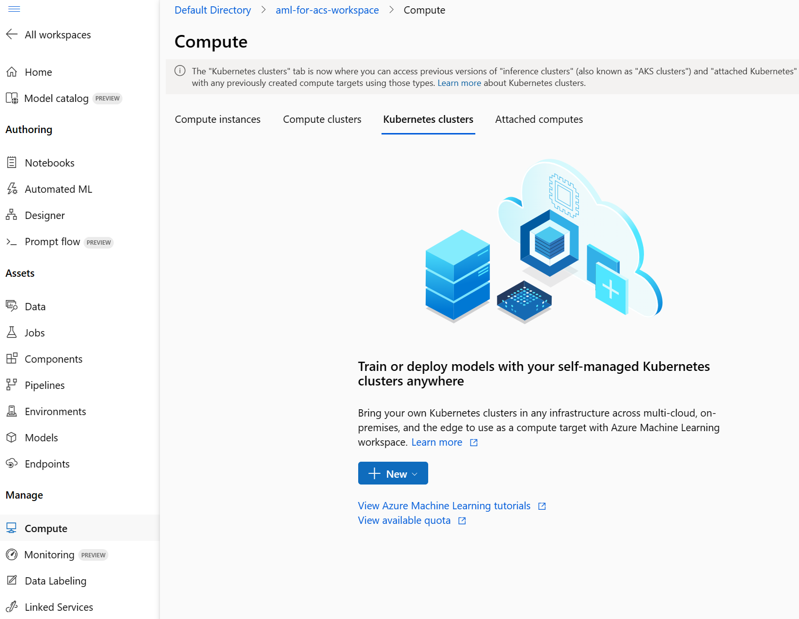
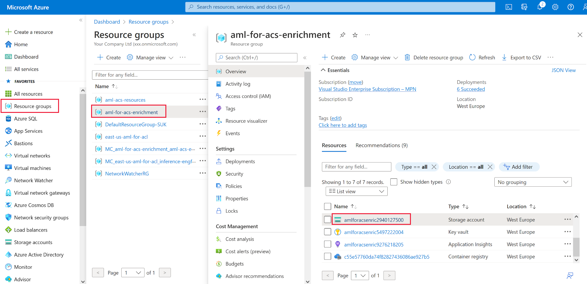
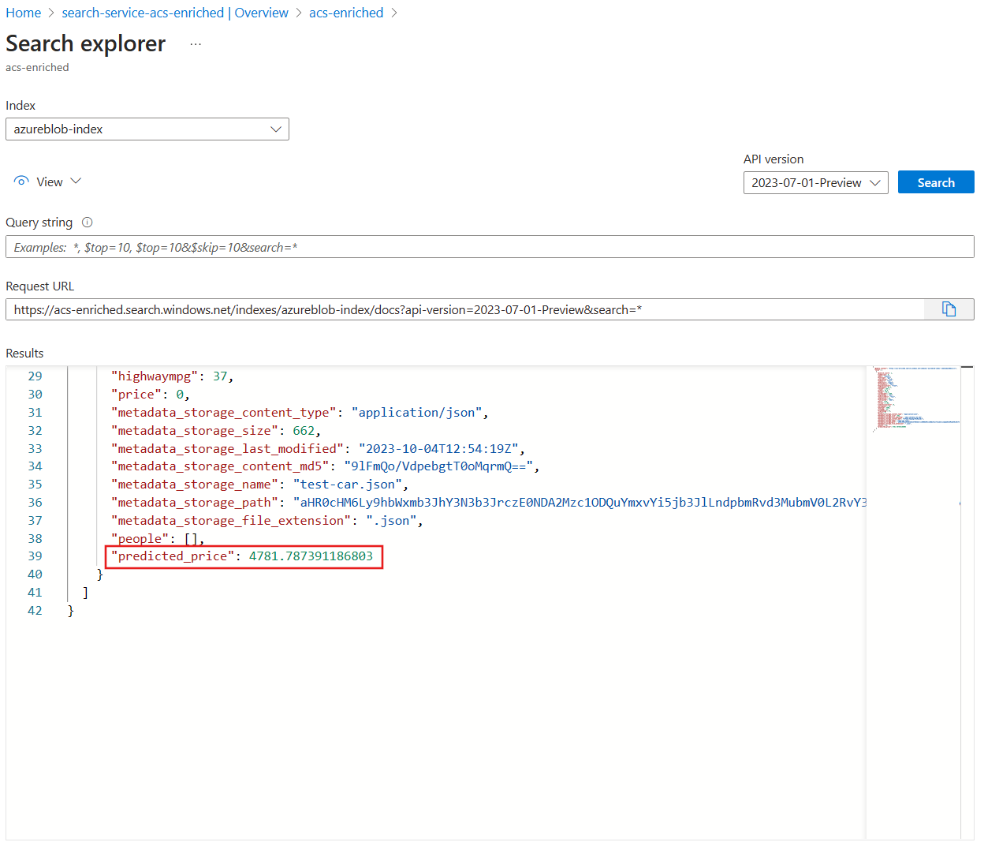

---
lab:
  title: 使用 Azure 机器学习模型扩充搜索索引
---

# 使用 Azure 机器学习模型扩充搜索索引

可以使用机器学习的强大功能来扩充搜索索引。 为此，你将使用在 Azure AI 机器学习工作室中训练的模型，并从机器学习自定义技能集中调用该模型。

在本练习中，你将创建 Azure AI 机器学习工作室模型，然后使用该模型训练、部署和测试终结点。 然后，你将使用 Azure AI 机器学习工作室终结点创建 Azure 认知搜索服务、创建示例数据并扩充索引。

> **注意** 为了完成本练习，你需要 Microsoft Azure 订阅。 如果你还没有，可在 [https://azure.com/free](https://azure.com/free?azure-portal=true) 注册免费试用版。
>

## 创建 Azure 机器学习工作区

在扩充搜索索引之前，请创建 Azure 机器学习工作区。 工作区让你有权访问 Azure AI 机器学习工作室（一种图形工具），你可使用它生成 AI 模型并部署这些模型以供使用。

1. 登录 [Azure 门户](https://portal.azure.com)。
1. 选择“+ 创建资源”。
1. 搜索机器学习，然后选择“Azure 机器学习”。
1. 选择**创建**。
1. 选择“资源组”下的“新建”，并将其命名为 aml-for-acs-enrichment。************
1. 在“工作区详细信息”部分中，输入 aml-for-acs-workspace 作为名称。********
1. 选择你附近的受支持区域。****
1. 对于存储帐户、密钥保管库、应用程序见解和容器注册表，请使用默认值。****************
1. 选择“查看 + 创建”。
1. 选择“创建”。
1. 等待部署 Azure 机器学习工作区，然后选择“转到资源”。
1. 在“概述”窗格中，选择“启动工作室”。

## 创建回归训练管道

你现在将创建回归模型，并使用 Azure AI 机器学习工作室管道对其进行训练。 你将根据汽车价格数据训练该模型。 训练后的模型将根据汽车特性预测汽车价格。

1. 在主页上选择“设计器”。****

1. 从预生成组件列表中，选择“回归 - 汽车价格预测(基本)”。

    

1. 选择“验证”。

1. 在“图形验证”窗格中，选择“在提交向导中选择计算目标”错误。********

    
1. 在“选择计算类型”下拉列表中，选择“计算实例”。******** 然后，在下方选择“创建 Azure ML 计算实例”。****
1. 在“计算名称”字段中，输入唯一名称（例如 compute-for-training）。********
1. 依次选择**查看 + 创建**、**创建**。

1. 在“选择 Azure ML 计算实例”字段中，从下拉列表中选择你的实例。**** 可能需要等待，直到它完成预配。

1. 再次选择“验证”，管道应看起来良好。****

    
1. 在“设置管道作业”窗格中选择“基本信息”。********
   > 注意：如果之前隐藏了“**设置管道作业**”窗格，可以通过选择 **“配置和提交”** 再次将其打开。
1. 在试验名称下选择“新建”。****
1. 在“新建试验名称”中，输入“linear-regression-training”。
1. 选择“查看 + 提交”，然后选择“提交”。********

### 为终结点创建推理群集

当管道正在训练线性回归模型时，可以创建终结点所需的资源。 此终结点需要 Kubernetes 群集，用于处理对模型的 Web 请求。

1. 在左侧选择“计算”。

    
1. 选择“Kubernetes 群集”，然后选择“+ 新建”。********
1. 在下拉列表中，选择“AksCompute”。****
1. 在“创建 AksCompute”窗格中，选择“新建”。********
1. 对于“位置”，选择用于创建其他资源的同一区域。****
1. 在 VM 大小列表中，选择“Standard_A2_v2”。****
1. 选择**下一步**。
1. 在“计算名称”中，输入“aml-acs-endpoint”。
1. 选择“启用 SSL 配置”。
1. 在“叶域”中，输入“aml-for-acs”。
1. 选择**创建**。

### 注册已训练的模型

管道作业应已完成。 需下载 `score.py` 和 `conda_env.yaml` 文件。 然后，你将注册已训练的模型。

1. 在左侧，选择“作业”。****

    
1. 选择你的试验，然后在表中选择已完成的作业，例如“回归 - 汽车价格预测(基本)”。**** 如果系统提示保存更改，请选择“放弃”更改。****
1. 在设计器中，选择右上角的“作业概述”，然后选择“训练模型”节点。********

    
1. 在“输出 + 日志”中，展开 trained_model_outputs 文件夹。********
1. 在 `score.py` 旁边，选择更多菜单 (...)，然后选择“下载”。********
1. 在 `conda_env.yaml` 旁边，选择更多菜单 (...)，然后选择“下载”。********
1. 选择选项卡顶部的“+ 注册模型”。****
1. 在“作业输出”字段中，选择 trained_model_outputs 文件夹。******** 然后，选择窗格底部的“下一步”。****
1. 输入 carevalmodel 作为模型名称。********
1. 在“说明”中，输入“用于预测汽车价格的线性回归模型”。********
1. 选择**下一步**。
1. 选择**注册**。

### 编辑评分脚本以正确响应 Azure AI 搜索

Azure 机器学习工作室已将两个文件下载到 Web 浏览器的默认下载位置。 需编辑 score.py 文件以更改 JSON 请求和响应的处理方式。 可使用文本编辑器或代码编辑器，例如 Visual Studio Code。

1. 在编辑器中，打开 score.py 文件。
1. 替换 run 函数的所有内容：

    ```python
    def run(data):
    data = json.loads(data)
    input_entry = defaultdict(list)
    for row in data:
        for key, val in row.items():
            input_entry[key].append(decode_nan(val))

    data_frame_directory = create_dfd_from_dict(input_entry, schema_data)
    score_module = ScoreModelModule()
    result, = score_module.run(
        learner=model,
        test_data=DataTable.from_dfd(data_frame_directory),
        append_or_result_only=True)
    return json.dumps({"result": result.data_frame.values.tolist()})
    ```

    使用此 Python 代码：

    ```python
    def run(data):
        data = json.loads(data)
        input_entry = defaultdict(list)
        
        for key, val in data.items():
                input_entry[key].append(decode_nan(val))
    
        data_frame_directory = create_dfd_from_dict(input_entry, schema_data)
        score_module = ScoreModelModule()
        result, = score_module.run(
            learner=model,
            test_data=DataTable.from_dfd(data_frame_directory),
            append_or_result_only=True)
        output = result.data_frame.values.tolist()
        
        return {
                "predicted_price": output[0][-1]
        }    
    ```

    上述更改允许模式接收具有汽车属性（而不是汽车数组）的单个 JSON 对象。

    另一个更改是只返回汽车的预测价格，而不是整个 JSON 响应。
1. 在文本编辑器中保存所做的更改。

## 创建自定义环境

接下来，你将创建自定义环境，以便可部署到实时终结点。

1. 在导航窗格中，选择**环境**。
1. 选择“自定义环境”选项卡。
1. 选择“+ 新建”。
1. 输入 my-custom-environment 作为名称。********
1. 在“选择环境类型”下的“特选环境”列表中，选择最新的“automl-gpu”版本。**********
1. 选择**下一步**。
1. 在本地计算机上，打开之前下载的 `conda_env.yaml` 文件并复制其内容。
1. 返回到浏览器，然后在“自定义”窗格中选择“conda_dependencies.yaml”。****
1. 在右侧窗格中，将其内容替换为之前复制的代码。
1. 选择“下一步”，然后再次选择“下一步”。********
1. 选择“创建”以创建自定义环境。****

## 使用更新后的评分代码部署模型 <!--Option for web service deployment is greyed out. Can't go further after trying several different things.-->

推理群集现在应可使用。 你还编辑了评分代码，用于处理来自 Azure 认知搜索自定义技能集的请求。 让我们为模型创建和测试终结点。

1. 在左侧，选择“模型”。
1. 选择注册的模型 carevalmodel。****

1. 选择“部署”，然后选择“实时终结点”。********

    
1. 对于“终结点名称”****，输入唯一名称，例如 car-evaluation-endpoint-1440637584****。
1. 对于“计算类型”，请选择“托管”。********
1. 对于“身份验证类型”****，选择“基于密钥”****。
1. 选择“下一步”，然后选择“下一步”。********
1. 再次选择“下一步”。
1. 在“选择用于推理的评分脚本”字段中，浏览到更新后的 `score.py` 文件并将其选中。****
1. 在“选择环境类型”下拉列表中，选择“自定义环境”。********
1. 从列表中选择自定义环境上的复选框。
1. 选择**下一步**。
1. 对于“虚拟机”，请选择 Standard_D2as_v4。****
1. 将“实例计数”设置为“1”。
1. 选择“下一步”，然后再次选择“下一步”。********
1. 选择**创建**。

等待部署模型，最多可能需要 10 分钟。 可在“通知”或 Azure 机器学习工作室的终结点部分中检查状态。****

### 测试经过训练的模型的终结点

1. 在左侧选择“终结点”。
1. 选择“car-evaluation-endpoint”。
1. 选择“测试”，在“输入数据以测试终结点”中粘贴此示例 JSON。********

    ```json
    {
        "symboling": 2,
        "make": "mitsubishi",
        "fuel-type": "gas",
        "aspiration": "std",
        "num-of-doors": "two",
        "body-style": "hatchback",
        "drive-wheels": "fwd",
        "engine-location": "front",
        "wheel-base": 93.7,
        "length": 157.3,
        "width": 64.4,
        "height": 50.8,
        "curb-weight": 1944,
        "engine-type": "ohc",
        "num-of-cylinders": "four",
        "engine-size": 92,
        "fuel-system": "2bbl",
        "bore": 2.97,
        "stroke": 3.23,
        "compression-ratio": 9.4,
        "horsepower": 68.0,
        "peak-rpm": 5500.0,
        "city-mpg": 31,
        "highway-mpg": 38,
        "price": 0.0
    }
    ```

1. 选择“测试”，随后应会看到响应：****

    ```json
    {
        "predicted_price": 5852.823214312815
    }
    ```

1. 选择“使用”。

    
1. 复制“REST 终结点”。
1. 复制“主密钥”。

### 将 Azure 机器学习模型与 Azure AI 搜索集成

接下来，创建新的认知搜索服务并使用自定义技能集扩充索引。

### 创建测试文件

1. 在 [Azure 门户](https://portal.azure.com/learn.docs.microsoft.com?azure-portal=true)中，选择“资源组”。
1. 选择“aml-for-acs-enrichment”。

    
1. 选择存储帐户，例如 amlforacsworks1440637584。****
1. 在“设置”下，选择“配置”。******** 然后，将“允许 Blob 匿名访问”**** 设置为“已启用”****。
1. 选择“保存”。
1. 在“数据存储”下，选择“容器”。 
1. 创建新的容器来存储索引数据，选择“+ 容器”。
1. 在“新建容器”窗格的“名称”中，输入“docs-to-search”。
1. 在“匿名访问级别”中，选择“容器(对容器和 Blob 进行匿名读取访问)”。********
1. 选择**创建**。
1. 选择你创建的 docs-to-search 容器。****
1. 在文本编辑器中，创建 JSON 文档：

    ```json
    {
      "symboling": 0,
      "make": "toyota",
      "fueltype": "gas",
      "aspiration": "std",
      "numdoors": "four",
      "bodystyle": "wagon",
      "drivewheels": "fwd",
      "enginelocation": "front",
      "wheelbase": 95.7,
      "length": 169.7,
      "width": 63.6,
      "height": 59.1,
      "curbweight": 2280,
      "enginetype": "ohc",
      "numcylinders": "four",
      "enginesize": 92,
      "fuelsystem": "2bbl",
      "bore": 3.05,
      "stroke": 3.03,
      "compressionratio": 9.0,
      "horsepower": 62.0,
      "peakrpm": 4800.0,
      "citympg": 31,
      "highwaympg": 37,
      "price": 0
    }
    ```

    将文档作为 `test-car.json` 扩展名保存到你的计算机上。
1. 在门户中，选择“上传”。
1. 在“上传 Blob”窗格中，选择“浏览文件”，导航到保存 JSON 文档的位置，然后选择该文档。********
1. 选择**上载**。

### 创建 Azure AI 搜索资源

1. 在 Azure 门户的主页上，选择“+ 创建资源”。****
1. 搜索“Azure AI 搜索”，然后选择“Azure AI 搜索”。********
1. 选择**创建**。
1. 在“资源组”中，选择“aml-for-acs-enrichment”。
1. 在服务名称中，输入唯一名称，例如 acs-enriched-1440637584。****
1. 对于“位置”，选择先前使用的相同区域。****
1. 依次选择“查看 + 创建”、“创建”。
1. 等待部署资源，然后选择“转到资源”。
1. 选择“导入数据”。
1. 在“连接到数据”窗格的“数据源”字段中，选择“Azure Blob 存储”。************
1. 在“数据源名称”中，输入 import-docs。********
1. 在“分析模式”中，选择“JSON”。
1. 在“连接字符串”中，选择“选择现有连接”。
1. 选择上传到的存储帐户，例如 amlforacsworks1440637584。****
1. 在“容器”窗格中，选择“docs-to-search”。 
1. 选择“选择”  。
1. 选择“下一步: 添加认知技能(可选)”。

### 添加认知技能

1. 展开“添加扩充”，然后选择“提取人员姓名”。
1. 单击“下一步：自定义目标索引”。
1. 选择“+ 添加字段”，在列表底部的“字段名称”中输入“predicted_price”。************
1. 在“类型”中，为新条目选择“Edm.Double”。********
1. 为所有字段选择“可检索”。****
1. 对于 make，请选择“可搜索”。********
1. 选择“下一步:创建索引器”。
1. 选择“提交”。

## 将 AML 技能添加到技能组

你现在将人员姓名扩充替换为 Azure 机器学习自定义技能集。

1. 在“概述”窗格中，选择“搜索管理”下的“技能集”。********
1. 在“名称”下，选择“azureblob-skillset”。
1. 将 `EntityRecognitionSkill` 的技能定义替换为此 JSON，记住替换复制的终结点和主密钥：

    ```json
    "@odata.type": "#Microsoft.Skills.Custom.AmlSkill",
    "name": "AMLenricher",
    "description": "AML studio enrichment example",
    "context": "/document",
    "uri": "PASTE YOUR AML ENDPOINT HERE",
    "key": "PASTE YOUR PRIMARY KEY HERE",
    "resourceId": null,
    "region": null,
    "timeout": "PT30S",
    "degreeOfParallelism": 1,
    "inputs": [
      {
        "name": "symboling",
        "source": "/document/symboling"
      },
      {
        "name": "make",
        "source": "/document/make"
      },
      {
        "name": "fuel-type",
        "source": "/document/fueltype"
      },
      {
        "name": "aspiration",
        "source": "/document/aspiration"
      },
      {
        "name": "num-of-doors",
        "source": "/document/numdoors"
      },
      {
        "name": "body-style",
        "source": "/document/bodystyle"
      },
      {
        "name": "drive-wheels",
        "source": "/document/drivewheels"
      },
      {
        "name": "engine-location",
        "source": "/document/enginelocation"
      },
      {
        "name": "wheel-base",
        "source": "/document/wheelbase"
      },
      {
        "name": "length",
        "source": "/document/length"
      },
      {
        "name": "width",
        "source": "/document/width"
      },
      {
        "name": "height",
        "source": "/document/height"
      },
      {
        "name": "curb-weight",
        "source": "/document/curbweight"
      },
      {
        "name": "engine-type",
        "source": "/document/enginetype"
      },
      {
        "name": "num-of-cylinders",
        "source": "/document/numcylinders"
      },
      {
        "name": "engine-size",
        "source": "/document/enginesize"
      },
      {
        "name": "fuel-system",
        "source": "/document/fuelsystem"
      },
      {
        "name": "bore",
        "source": "/document/bore"
      },
      {
        "name": "stroke",
        "source": "/document/stroke"
      },
      {
        "name": "compression-ratio",
        "source": "/document/compressionratio"
      },
      {
        "name": "horsepower",
        "source": "/document/horsepower"
      },
      {
        "name": "peak-rpm",
        "source": "/document/peakrpm"
      },
      {
        "name": "city-mpg",
        "source": "/document/citympg"
      },
      {
        "name": "highway-mpg",
        "source": "/document/highwaympg"
      },
      {
        "name": "price",
        "source": "/document/price"
      }
    ],
    "outputs": [
      {
        "name": "predicted_price",
        "targetName": "predicted_price"
      }
    ]  
    ```

1. 选择“保存”。

### 更新输出字段映射

1. 返回到搜索服务的“概述”**** 窗格，选择“索引器”****，然后选择“azureblob-indexer”****。
1. 选择“索引器定义(JSON)”选项卡，然后将 outputFieldMappings 值更改为：********

    ```json
    "outputFieldMappings": [
        {
          "sourceFieldName": "/document/predicted_price",
          "targetFieldName": "predicted_price"
        }
      ]
    ```

1. 选择“保存”。
1. 选择“重置”，然后选择“是”********。
1. 选择“运行”，然后选择“是”********。

## 测试索引扩充

更新后的技能集现在会将预测值添加到索引中的测试汽车文档中。 要对此进行测试，请按照以下步骤操作。

1. 在搜索服务的“概述”窗格中，选择窗格顶部的“搜索资源管理器”。********
1. 选择“搜索”。
1. 滚动到结果的底部。
    
应会看到填充的字段 `predicted_price`。

## 清理

现已完成练习，请删除所有不再需要的资源。 删除 Azure 资源：

1. 在 **Azure 门户**中，选择“资源组”。
1. 选择不需要的资源组，然后选择“删除资源组”。****
