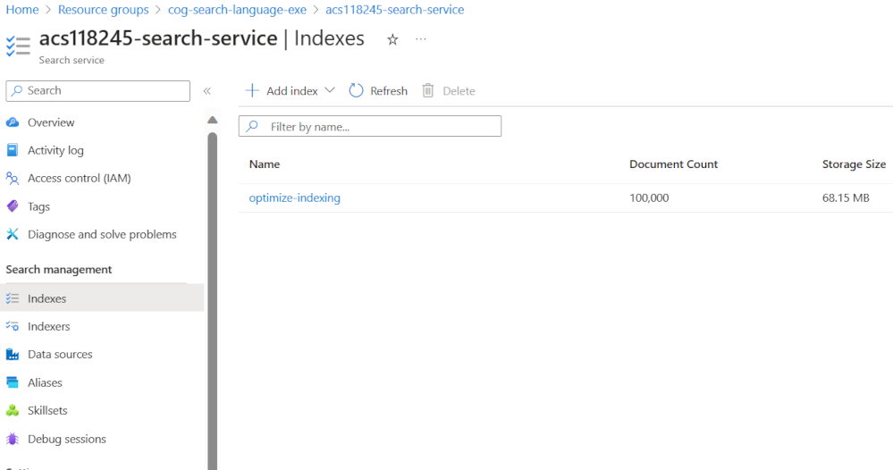

---
lab:
  title: 使用推送 API 添加到索引
---

# 使用推送 API 添加到索引

你希望探索如何使用 C# 代码创建 Azure AI 搜索索引并将文档上传到该索引。

在本练习中，你将克隆现有的 C# 解决方案并运行该方案，以了解用于上传文档的最佳批大小。 然后，你将使用此批大小，并使用线程方法有效地上传文档。

> 注意**** 为了完成本练习，你需要 Microsoft Azure 订阅。 如果你还没有该订阅，可通过 [https://azure.com/free](https://azure.com/free?azure-portal=true) 注册免费试用版。

## 设置 Azure 资源

为了节省时间，请选择此 Azure 资源管理器模板来创建后面练习中需要的资源：

1. [将资源部署到 Azure](https://portal.azure.com/#create/Microsoft.Template/uri/https%3A%2F%2Fraw.githubusercontent.com%2FMicrosoftLearning%2Fmslearn-knowledge-mining%2Fmain%2FLabfiles%2F07-exercise-add-to-index-use-push-api%20lab-files%2Fazuredeploy.json) - 选择此链接以创建 Azure AI 资源。
    
1. 在“资源组”中，选择“新建”并将其命名为 cog-search-language-exe。
1. 在“区域”中，选择离你较近的[受支持区域](/azure/ai-services/language-service/custom-text-classification/service-limits#regional-availability)。
1. 资源前缀需要全局唯一，请输入随机数字和小写字母前缀，例如 acs118245********。
1. 在“位置”中，选择和上面选择的相同区域。
1. 选择“查看 + 创建”。
1. 选择“创建”。
1. 部署完成后，选择“转到资源组”以查看已创建的所有资源****。

    

## 复制 Azure AI 搜索服务 REST API 信息

1. 在资源列表中，选择已创建的搜索服务。 在上面的示例中，该服务为 acs118245-search-service****。
1. 将搜索服务名称复制到文本文件中。

    
1. 在左侧，选择“密钥”，然后将“主管理密钥”复制到同一文本文件中。

## 下载要在 Visual Studio Code 中使用的示例代码

你将使用 Visual Studio Code 运行 Azure 示例代码。 此代码文件已在 GitHub 存储库中提供。

1. 启动 Visual Studio Code。
1. 打开面板 (SHIFT+CTRL+P) 并运行“**Git：Clone**”命令，以将 `https://github.com/MicrosoftLearning/mslearn-knowledge-mining` 存储库克隆到本地文件夹（任意文件夹均可）。
1. 克隆存储库后，在 Visual Studio Code 中打开文件夹。
1. 等待其他文件安装完毕，以支持存储库中的 C# 代码项目。

    > **注意**：如果系统提示你添加生成和调试所需的资产，请选择**以后再说**。

1. 在左侧导航中，展开“**optimize-data-indexing/v11/OptimizeDataIndexing**”文件夹，然后选择“**appsettings.json**”文件。

    
1. 粘贴搜索服务名称和主管理密钥。

    ```json
    {
      "SearchServiceUri": "https://acs118245-search-service.search.windows.net",
      "SearchServiceAdminApiKey": "YOUR_SEARCH_SERVICE_KEY",
      "SearchIndexName": "optimize-indexing"
    }
    ```

    设置文件应该与上面类似。
1. 通过按 CTRL + S 保存所做的更改****。
1. 右键单击“**OptimizeDataIndexing**”文件夹，选择“**在集成终端中打开**”。
1. 在终端中输入`dotnet run`，然后按 **Enter**。

    
输出显示在这种情况下，性能最佳的批大小为 900 个文档， 当它达到每秒 6.071 MB 时。

## 编辑代码以实现线程处理和退避重试策略

注释掉的代码可以更改应用，以使用线程将文档上传到搜索索引。

1. 请确保你已经选择 Program.cs****。

    
1. 对第 37 行和第 38 行注释禁止，如下所示：

    ```csharp
    //Console.WriteLine("{0}", "Finding optimal batch size...\n");
    //await TestBatchSizesAsync(searchClient, numTries: 3);
    ```

1. 对第 44 行到第 48 行取消注释。

    ```csharp
    Console.WriteLine("{0}", "Uploading using exponential backoff...\n");
    await ExponentialBackoff.IndexDataAsync(searchClient, hotels, 1000, 8);

    Console.WriteLine("{0}", "Validating all data was indexed...\n");
    await ValidateIndexAsync(indexClient, indexName, numDocuments);
    ```

    用于控制批大小和线程数的代码为 `await ExponentialBackoff.IndexDataAsync(searchClient, hotels, 1000, 8)`。 批大小为 1000 个，线程数为 8 个。

    
    代码应如上所示。

1. 若要保存更改，请按 Ctrl + S。
1. 选择终端，然后按任意键结束正在运行的进程（如果尚未执行）。
1. 在终端中运行 `dotnet run`。

    应用将启动 8 个线程，然后在每个线程完成向控制台写入新消息时：

    ```powershell
    Finished a thread, kicking off another...
    Sending a batch of 1000 docs starting with doc 57000...
    ```

    上传 100,000 个文档后，应用会编写摘要（此过程可能需要一段时间才能完成）：

    ```powershell
    Ended at: 9/1/2023 3:25:36 PM
    
    Upload time total: 00:01:18:0220862
    Upload time per batch: 780.2209 ms
    Upload time per document: 0.7802 ms
    
    Validating all data was indexed...
    
    Waiting for service statistics to update...
    
    Document Count is 100000
    
    Waiting for service statistics to update...
    
    Index Statistics: Document Count is 100000
    Index Statistics: Storage Size is 71453102
    
    ``````

浏览 `TestBatchSizesAsync` 过程中的代码，了解代码如何测试批大小性能。

浏览 `IndexDataAsync` 过程中的代码，了解代码如何管理线程。

浏览 `ExponentialBackoffAsync` 中的代码，了解代码如何实现指数退避重试策略。

可在 Azure 门户中搜索并验证文档是否已添加到索引中。



## 清理

现已完成练习，请删除所有不再需要的资源。 从克隆到计算机的代码开始。 然后删除 Azure 资源。

1. 在 **Azure 门户**中，选择“资源组”。
1. 选择为本练习创建的资源组。
1. 选择“删除资源组”****。 
1. 确认删除，然后选择“删除”****。
1. 选择不需要的资源，然后选择“删除”。
