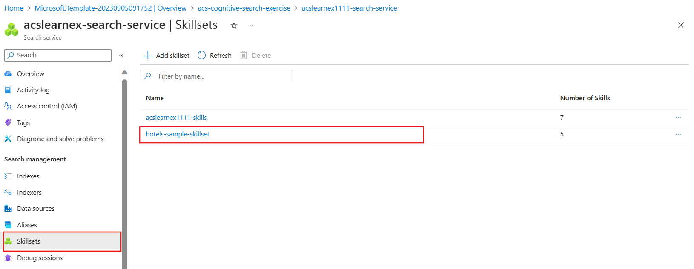

---
lab:
  title: 调试搜索问题
---

# 调试搜索问题

已生成搜索解决方案，但注意到索引器上显示了一些警告。

在本练习中，你将创建 Azure AI 搜索解决方案，导入一些示例数据，然后解决索引器上的警告。

> **注意** 为了完成本练习，你需要 Microsoft Azure 订阅。 如果你还没有，可在 [https://azure.com/free](https://azure.com/free?azure-portal=true) 注册免费试用版。

## 创建搜索解决方案

在开始使用调试会话之前，需要创建 Azure AI 搜索服务。

1. [将资源部署到 Azure](https://portal.azure.com/#create/Microsoft.Template/uri/https%3A%2F%2Fraw.githubusercontent.com%2FMicrosoftLearning%2Fmslearn-knowledge-mining%2Fmain%2FLabfiles%2F08-debug-search%2Fazuredeploy.json) - 如果位于托管 VM 中，请复制此链接并将其粘贴到 VM 浏览器中。 否则，选择此链接可在 Azure 门户中部署所需的所有资源。

    

1. 在“**资源组**”下，选择提供的资源组，或选择“**新建**”并键入 **debug-search-exercise**。
1. 选择离你最近的“**区域**”，或使用默认值。
1. 对于“**资源前缀**”，请输入 **acslearnex** 并添加数字或字符的随机组合，以确保存储名称是唯一的。
1. 在“位置”中选择上面使用的相同区域。
1. 在窗格底部，选择“查看 + 创建”。
1. 等到资源部署完成，然后选择“转到资源组”。

## 导入示例数据并配置资源

已创建资源，现在可以导入源数据。

1. 在列出的资源中，导航到存储账户。 转到左窗格中的“**配置**”，将“**允许 Blob 匿名访问**”设置为“**已启用**”，然后选择“**保存**”。
1. 导航回资源组，选择搜索服务。
1. 在“概述”窗格上，选择“导入数据”。

      

1. 在“数据源”的“导入数据”窗格上，选择“示例”。

      

1. 在示例列表中，选择 hotels-sample。
1. 选择“下一步: 添加认知技能(可选)”。
1. 展开“添加扩充”部分。

    

1. 选择“文本认知技能”。
1. 选择“下一步: 自定义目标索引”。
1. 保留默认值，然后选择“下一步: 创建索引器”。
1. 选择“提交”。

## 使用调试会话解决索引器上的警告

索引器现在开始引入 50 个文档。 但是，如果检查索引器的状态，会发现存在警告。

1. 在左窗格中选择“调试会话”。****
1. 选择“+ 添加调试会话”。
1. 提供会话名称，并为“**索引器模板”** 选择 **hotel-sample-indexer**。
1. 从“**存储帐户**”字段中选择存储帐户。 这会自动创建存储容器，以便保存调试数据。
1. 取消选中使用托管标识进行身份验证的复选框。
1. 选择“保存”。
1. 创建后，调试会话将自动在搜索服务中的数据上运行。 完成时应包含错误/警告。

    依赖项关系图显示，对于每个文档，有三个技能有错误。
    

    > **备注**：你可能会看到有关连接到存储帐户和配置托管标识的错误。 如果在启用匿名 Blob 访问后尝试过快地进行调试，则会出现这种情况，但运行调试会话仍应正常工作。 几分钟后刷新浏览器窗口应会删除警告。

1. 在依赖项关系图中，选择其中一个出现错误的技能节点。
1. 在“技能详细信息”窗格中，选择“错误/警告(1)”。

    详细信息如下：

    *无效语言代码“(未知)”。支持的语言：af、am、ar、as、az、bg、bn、bs、ca、cs、cy、da、de、el、en、es、et、eu、fa、fi、fr、ga、gl、gu、he、hi、hr、hu、hy、id、it、ja、ka、kk、km、kn、ko、ku、ky、lo、lt、lv、mg、mk、ml、mn、mr、ms、my、ne、nl、no、or、pa、pl、ps、pt-BR、pt-PT、ro、ru、sk、sl、so、sq、sr、ss、sv、sw、ta、te、th、tr、ug、uk、ur、uz、vi，zh-Hans，zh-Hant。有关其他详细信息，请参阅 https://aka.ms/language-service/language-support。*

    如果回顾依赖项关系图，会发现“语言检测”技能对三种技能的输出都有错误。 如果查看包含错误的技能设置，将看到导致错误的技能输入是 `languageCode`。

1. 在依赖项关系图中，选择“语言检测”。

    
    查看技能设置 JSON，请注意用于推断语言的字段是 `HotelId`。

    此字段将导致错误，因为技能无法基于 ID 推断语言。

## 解决索引器上的警告

1. 在输入下选择“源”，并将字段更改为 `/document/Description`。****
1. 选择“保存”。
1. 选择“运行”。 索引器应不再显示任何错误或警告。 现在可以更新技能组。

    
   
1. 选择“**提交更改**”，将此会话中所做的更改推送到索引器。
1. 选择“确定”****。 现在可以删除会话。

现在，需要确保技能组已附加到 Azure AI 服务资源，否则将命中基本配额，索引器将超时。 

1. 为此，请在左窗格中选择“技能集”，然后选择“hotels-sample-skillset”。********

    
1. 选择“连接 AI 服务”****，然后选择列表中的 AI 服务资源。

    
1. 选择“保存”。

1. 现在运行索引器，使用固定的 AI 扩充更新文档。 为此，请在左窗格中选择“索引器”，选择“hotels-sample-indexer”，然后选择“运行”。************  完成运行时，应会看到现在已无警告。

    

## 清理

 完成练习后，如果你已完成对 Azure AI 搜索服务的学习，请删除在练习期间创建的 Azure 资源。 最简单的方法是删除 **debug-search-exercise** 资源组。
