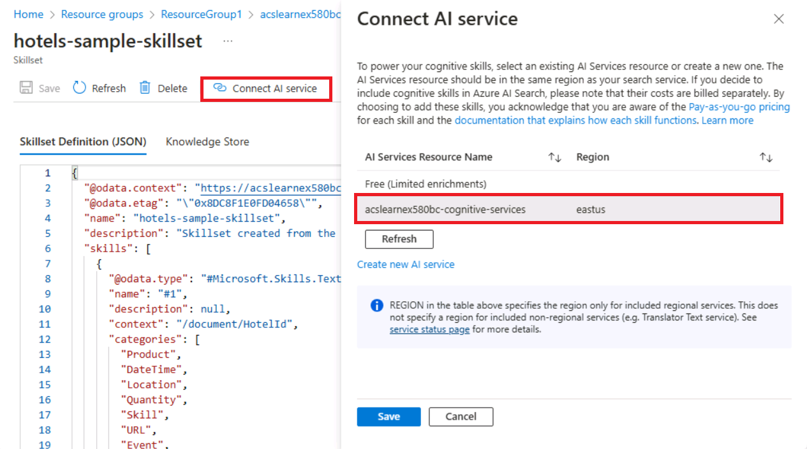

---
lab:
  title: 调试搜索问题
---

# 调试搜索问题

已生成搜索解决方案，但注意到索引器上显示了一些警告。

在本练习中，你将创建 Azure AI 搜索解决方案，导入一些示例数据，然后解决索引器上的警告。

> **注意** 为了完成本练习，你需要 Microsoft Azure 订阅。 如果你还没有，可在 [https://azure.com/free](https://azure.com/free?azure-portal=true) 注册免费试用版。

## 创建搜索解决方案

在开始使用调试会话之前，需要创建 Azure 认知搜索服务。

1.  选择此按钮可在 Azure 门户中部署所需的所有资源。

    

1. 在“资源组”下选择“新建”。
1. 键入 acs-cognitive-search-exercise。
1. 选择离你最近的“区域”。
1. 对于“资源前缀”，请输入 acslearnex 并添加数字或字符的随机组合，以确保存储名称是唯一的。********
1. 在“位置”中选择上面使用的相同区域。
1. 在窗格底部，选择“查看 + 创建”。
1. 等到资源部署完成，然后选择“转到资源组”。

## 导入示例数据

已创建资源，现在可以导入源数据。

1. 在列出的资源中，选择搜索服务。

1. 在“概述”窗格上，选择“导入数据”。

      

1. 在“数据源”的“导入数据”窗格上，选择“示例”。

      

1. 在示例列表中，选择 hotels-sample。
1. 选择“下一步: 添加认知技能(可选)”。
1. 展开“添加扩充”部分。

    

1. 选择“文本认知技能”。
1. 选择“下一步: 自定义目标索引”。
1. 保留默认值，然后选择“下一步: 创建索引器”。
1. 选择“提交”。

## 使用调试会话解决索引器上的警告

索引器现在开始引入 50 个文档。 但是，如果检查索引器的状态，会发现存在警告。

1. 在左窗格中选择“调试会话”。****

1. 选择“+ 添加调试会话”。

1. 为存储连接字符串选择“选择现有连接”，然后选择你的存储帐户。****

    
1. 选择“+ 容器”来添加新容器。**** 将其命名为 acs-debug-storage。****

    

1. 将“匿名访问级别”设置为“容器(对容器和 Blob 进行匿名读取访问)”。********

    > **注意**：可能需要启用 Blob 匿名才能选择此选项。 为此，请在存储帐户中转到“配置”，将“允许 Blob 匿名访问”设置为“已启用”，然后选择“保存”。****************

1. 选择**创建**。
1. 在列表中选择新容器，然后选中“选择”。****
1. 为“索引器模板”选择“hotel-sample-indexer”。********
1. 选择“保存会话”。

    依赖项关系图显示，对于每个文档，有三个技能有错误。
    

1. 选择 V3。
1. 在“技能详细信息”窗格中，选择“错误/警告(1)”。
1. 展开“消息”列，以便查看详细信息。

    详细信息如下：

    *无效的语言代码“（未知）”。支持的语言：ar、cs、da、de、en、es、fi、fr、hu、it、ja、ko、nl、no、pl、pt-BR、pt-PT、ru、sv、tr、zh-Hans。有关更多详细信息，请参阅 https://aka.ms/language-service/language-support。*

    如果回顾依赖项关系图，会发现“语言检测”技能有三个技能的输出，并带有警告。 导致错误的技能输入也是 `languageCode`。

1. 在依赖项关系图中，选择“语言检测”。

    
    查看技能设置 JSON，请注意用于推断语言的字段是 `HotelId`。

    此字段将导致错误，因为技能无法基于 ID 推断语言。

## 解决索引器上的警告

1. 在输入下选择“源”，并将字段更改为 `/document/Description`。****
    
1. 选择“保存”。
1. 选择“运行”。

    

    索引器应不再显示任何错误或警告。 现在可以更新技能组。

1. 选择“提交更改...”

    
1. 选择“确定”。

1. 现在，需要确保技能组已附加到 Azure AI 服务资源，否则将命中基本引用，索引器将超时。 为此，请在左窗格中选择“技能集”，然后选择“hotels-sample-skillset”。********

    
1. 选择“AI 服务”选项卡，然后选择列表中的 AI 服务资源。****

    
1. 选择“保存”。

1. 现在运行索引器，使用固定的 AI 扩充更新文档。 为此，请在左窗格中选择“索引器”，选择“hotels-sample-indexer”，然后选择“运行”。************  完成运行时，应会看到现在已无警告。

    

> [!TIP]
> 完成练习后，如果你已完成对 Azure AI 搜索服务的学习，请删除在练习期间创建的 Azure 资源。 最简单的方法是删除 acs-cognitive-search-exercise 资源组。
