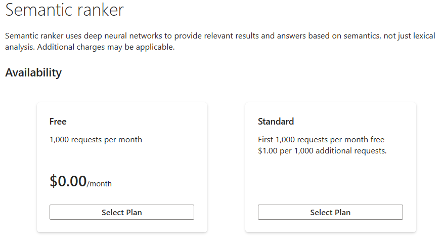

---
lab:
  title: 设置语义搜索
---

# 设置语义搜索

> 注意：要完成此实验室，需要一个你在其中具有管理权限的 [Azure 订阅](https://azure.microsoft.com/free?azure-portal=true)。 本练习还需要具有计费层的 Azure AI 搜索服务。

在本练习中，你将向索引添加语义搜索，并使用语义搜索进行查询。

## 启用语义搜索

1. 转到 Azure 门户并登录。
1. 选择“所有资源”并选择你的搜索服务****。
1. 在导航窗格中，选择“语义搜索(预览版)”****。
1. 在“**可用性**”的“**免费**”选项中，选择“**选择计划**”。



## 导入示例索引

1. 在 Azure 门户主页中选择“所有资源”，然后选择你的搜索服务****。
1. 选择“导入数据”。

    

1. 在“**数据源**”中，选择“**示例**”。
1. 选择“**酒店示例**”，然后选择“**下一步：添加认知技能(可选)”**。
1. 选择“跳到: 自定义目标索引”。
1. 选择“下一步:创建索引器”。
1. 选择“提交”。

## 配置语义排名

启用搜索索引和语义搜索后，可以配置语义排名。 需要支持查询请求上的预览 API 的搜索客户端。 可以在 Azure 门户、Postman 应用、用于 .NET 的 Azure SDK 或用于 Python 的 Azure SDK 中使用搜索资源管理器。 在本练习中，你将在 Azure 门户中使用搜索资源管理器。

若要配置语义排名，请执行以下步骤：

1. 在 Azure 门户主页中选择“所有资源”，然后选择你的搜索服务****。
1. 在导航栏上的“搜索管理”中，选择“索引”********。

    

1. 选择你的索引。
1. 选择“语义配置”，然后选择“添加语义配置”********。
1. 在“**名称**”类型 **hotels-conf** 中。
1. 在“**标题字段**”中 ，选择“**HotelName**”。
1. 在“**内容字段**”下的“**字段名称**”中，选择“**说明**”。
1. 为以下字段重复上面的步骤：
    - **类别**
    - **Address/City**
1. 在“**关键字字段**”下，在“**字段名称**”中，选择“**标记**”。
1. 选择“保存”。
1. 在索引页上，选择“保存”****。
1. 在 Azure 门户主页中选择“所有资源”，然后选择你的搜索服务****。
1. 在导航栏上的“搜索管理”中，选择“索引”********。

    

1. 选择你的索引。
1. 选择“**搜索资源管理器**”。
1. 选择“**视图**”并选择“**JSON 视图**”。
1. 在 JSON 查询编辑器类型中，输入以下文本：

    ```json
        {
            "queryType": "semantic",
            "queryLanguage" : "en-us",
            "search": "all hotels near the water" , 
            "semanticConfiguration": "hotels-conf" , 
            "searchFields": "",
            "speller": "lexicon" , 
            "answers": "extractive|count-3",
            "count": true
        }
    ```

1. 选择**搜索**。
1. 查看查询的结果。

## 清理

如果不再需要 Azure AI 搜索服务，则应从 Azure 订阅中删除相应资源以降低成本。

>**注意**：删除 Azure AI 搜索服务可确保不会向你的订阅收取相应资源的费用。 但是，只要订阅中存在存储的数据，就需要为数据存储支付少量费用。 如果已完成认知搜索服务的探索，则可以删除认知搜索服务和相关资源。 但是，如果计划完成本系列中任何其他实验室，则需要重新创建它。
> 删除资源：
> 1. 在 [Azure 门户](https://portal.azure.com?azure-portal=true)的“**资源组**”页面中，打开在创建认知搜索服务时指定的资源组。
> 1. 单击“删除资源组”，键入资源组名称以确认要删除资源组，然后选择“删除”。
